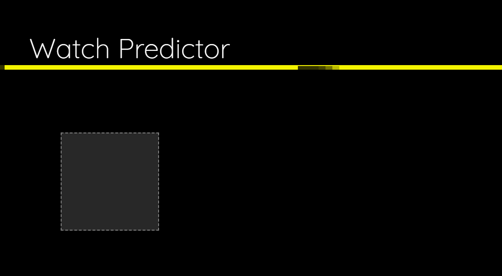

# Watch-Predictor
Full Stack ML App

This is a full stack web application that combines web technologies and ML tools. It uses a slightly modified version of the Xception model (https://arxiv.org/abs/1610.02357) to recognize
images of four different categories of watches: Rolex, Cartier, Omega, and Seiko. The model was trained on my local computer and therefore used a much smaller-than-ideal
number of images to train. This could be improved by training on the cloud (using AWS, for example). Nonetheless, the accuracy of 
the trained model is acceptable, with a test accuracy of about 80%. 

